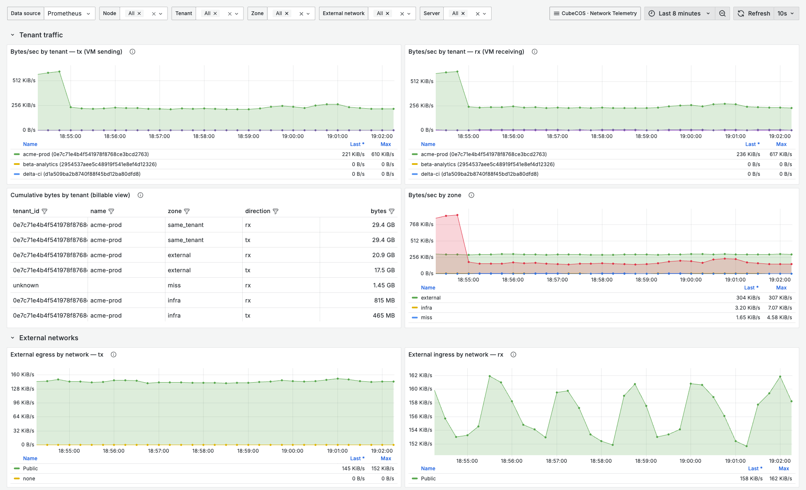
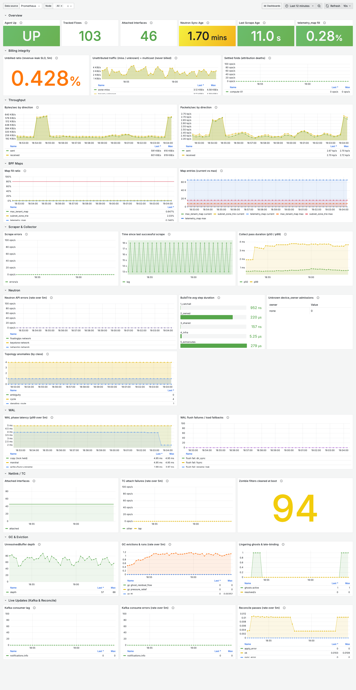

<!-- PROJECT HEADER -->
<div align="left">
  <h2 align="left">📊 Lachesis</h2>
  <p align="left"><em>Billing-grade, per-tenant network telemetry for OpenStack — every byte attributed to the tenant that owns it, at line rate, in eBPF.</em></p>
</div>

[![License][License-Image]][License-Url] [![made-with-Go][Go-Made-Image]][Go-Made-Url] [![Go Reference][Go-Ref-Image]][Go-Ref-Url] [![CI][CI-Image]][CI-Url] [![CodeQL][CodeQL-Image]][CodeQL-Url] [![GitHub last commit][GitHub-Last-Commit-Image]][GitHub-Last-Commit-Url]

⛩️ [Architecture](#-architecture) | 🛠️ [Operating] | 🧪 [Test strategy] | 👷 [Contributing]

<br/>

<p align="center">
  
  <br/>
  <sub><em>Per-tenant, per-zone, per-direction traffic — live from a real OpenStack compute node. (Tenant/server names anonymised.)</em></sub>
</p>

## 🥽 Overview

**Lachesis** is an eBPF-based network-telemetry daemon for OpenStack. It attributes **every byte** on a compute node to the tenant that owns it — classifying north-south and east-west traffic into billing zones, re-attributing Octavia load-balancer bytes to the real client tenant, and exposing per-tenant Prometheus counters at line rate via TC `clsact` hooks.

It runs as one static Go binary per compute node on OVN-based OpenStack (Yoga), and is built for **billing-grade** accounting: crash-resilient, monotonic per-tenant counters that survive agent restarts, kernel-map churn, and VM lifecycle events.

## 🤔 Why Lachesis?

Generic flow tools (sFlow/NetFlow) and host exporters tell you *how much* traffic a node moved. They can't tell you, correctly and durably, **which tenant to bill for it**. Lachesis is built for exactly that:

- **Attribution, not just counting** — bytes are keyed to the owning tenant *and* a billing zone (same-tenant, cross-tenant, infra, external, shared), decided in-kernel at each VM tap.
- **Billing-grade durability** — a custom Prometheus collector (never `CounterVec`) plus a write-ahead log means counters never reset to zero on a restart, so `rate()` never goes negative and revenue is never double-counted or lost.
- **Octavia-aware** — load-balancer bytes are folded back to the originating client tenant instead of vanishing into the amphora.
- **Line-rate, low-overhead** — aggregation happens in a `PERCPU_HASH` in the kernel; userspace only drains deltas on a scrape tick, with zero-allocation hot paths gated by a CI benchmark.

## ✨ Features

**Billing accuracy**
- **Per-tenant, per-zone, per-direction byte & packet accounting** — the billing metric `lachesis_bytes_total{tenant_id,zone,direction,external_network}`.
- **Five traffic zones** — `same_tenant`, `other_tenant`, `infra`, `external`, `shared` — from a hybrid L2 MAC lookup plus an LPM zone trie.
- **Octavia re-attribution** — LB bytes billed to the client tenant, not the amphora.
- **Per-server drill-down** — an optional mortal per-server family for capacity views alongside the immortal per-tenant billing family.

**eBPF data plane**
- **TC `clsact` at every VM tap** — kernel-side aggregation in a `PERCPU_HASH`, no per-packet copies to userspace.
- **Dynamic attach** — netlink-driven; taps are attached/detached as VMs come and go, with idempotent replace and boot-time zombie-filter cleanup.
- **Read-don't-clear maps** — the scrape loop computes deltas against remembered raw values; eviction is the GC's job alone, so a crash at any instant is non-destructive.

**Operability**
- **Live hot-reload (`SIGHUP`)** — retune scrape/flush cadence, GC watermarks, ghost-grace and reconcile ceiling on a *running* agent — no restart, no counting gap. Invalid edits are rejected whole; a reload counter and `/debug/config` confirm what took effect.
- **A real `/debug` surface** — operator pages for topology, zones, live IP/MAC → tenant lookup, and topology-anomaly detection (route cycles, duplicate router MACs, multi-external-path VMs), plus stdlib `pprof`. `/debug/config` renders the effective config with secrets redacted, and runtime log level flips via `PUT /debug/log-level`.
- **Everything is one curl from a script** — every `/debug` HTML page also serves its exact view model as JSON with `?format=json`.
- **Two ready-to-import Grafana dashboards + a paging alert rule** — multi-agent/cluster-aware via a `$node` variable (`deploy/grafana/`).

**Resilience & observability**
- **Crash-resilient by design** — a custom `prometheus.Collector` (no counter resets on restart) and an atomic JSON write-ahead log (temp-file + rename + fsync, one `.bak` generation, additive schema).
- **Deep self-instrumentation** — *every* subsystem reports on `/metrics`: scraper lag/errors, WAL flush latency, BPF map fill-vs-max, GC eviction rates, Neutron sync age & API errors, Kafka lag, collect-pass p50/p99.
- **Kafka-driven live metadata** — near-instant MAC learning from Neutron events, with a periodic full reconcile as the freshness floor.
- **Lingering-ghost lifecycle** — dying FIN/RST packets from a just-deleted port still attribute correctly for a grace window before the metadata is reaped.

## 🚀 Quick start

The build is fully containerized (eBPF toolchain in Docker); the agent runs as root on a Linux compute node.

**1. Build**

```bash
task setup      # pull the eBPF builder image
task generate   # bpf2go — compile telemetry.c, generate the loader
task binary     # build ./build/agent (linux/amd64)
```

**2. Run** (on an OVN compute node, as root)

```bash
cp deploy/agent/config.example.yaml /etc/lachesis/config.yaml   # edit to taste
./build/agent -config /etc/lachesis/config.yaml
```

Configure via that YAML and/or `LACHESIS_*` env vars (e.g. `LACHESIS_HTTP_LISTEN`, `LACHESIS_BPF_ATTACH_INTERFACES`). Then look at it:

```bash
curl -s localhost:9090/metrics | grep lachesis_bytes_total   # the billing family
open  http://localhost:9090/debug                            # operator surface
```

**3. Visualize** — bring up the local Prometheus + Grafana stack:

```bash
cd deploy/grafana && docker compose up      # Grafana on :3000, Prometheus on :9091
```

The dashboards above ship in `deploy/grafana/dashboards/`. See [Operating] for the full runbook.

## 🏛 Architecture

Four layers, one binary per compute node:

```
  L4  Prometheus + WAL      custom Collector · GlobalState · JSON write-ahead log
  L3  Go agent              scraper · delta math · Octavia attribution · Netlink watcher
  L2  OpenStack metadata    per-tenant zone trie + MAC map, synced from the Neutron API
  L1  eBPF (TC clsact)      tc_telemetry_in/out · PERCPU_HASH · LPM trie · mac_tenant_map
```

The **boot order is strict and sync-pointed** (out-of-order startup silently misclassifies flows, so it isn't left to chance): clean up orphaned TC filters → load eBPF objects → Neutron cold-start populates metadata *before any packet* → subscribe netlink then sweep existing taps → restore state from the WAL → start workers.

## 🩺 Operability at a glance

Health and internals are visible without attaching a debugger:

```bash
# retune a running agent — no restart, no counting gap
vi /etc/lachesis/config.yaml && kill -HUP "$(pidof agent)"
curl -s localhost:9090/metrics | grep lachesis_config_reloads_total   # result="applied"

# resolve an IP or MAC to its tenant + zone, as JSON
curl -s 'localhost:9090/debug/lookup?ip=10.0.0.5&format=json'
```

<p align="center">
  
  <br/>
  <sub><em>The agent instruments itself: scrape lag, WAL latency, BPF map fill, GC, Neutron sync age and Kafka lag all on <code>/metrics</code>.</em></sub>
</p>

## 🧪 Testing

- `task test` — unit tests (no privileges required).
- `task test-integration` — privileged-Docker eBPF/kernel tests.
- `task bench-gate` — the zero-allocation benchmark gate on the hot paths.
- **`scenariotest`** — the live tier: stand up a declared OpenStack topology, drive real traffic, and assert per-tenant/zone/direction byte attribution end-to-end against a running agent, with automatic teardown.

See [Test strategy] for the full picture.

## 🧑‍💻 Community

- [License](./LICENSE)
- [Contributing](./CONTRIBUTING.md)
- [Code of Conduct](./CODE_OF_CONDUCT.md)
- [Security](./SECURITY.md)

## 📄 License

Licensed under the [Apache License 2.0](./LICENSE). Copyright © 2026 [Bigstack co., ltd](https://bigstack.co/).

<!-- LINKS -->
[Operating]: ./docs/runtime.md
[Test strategy]: ./docs/test-strategy.md
[Contributing]: ./CONTRIBUTING.md
[License-Url]: https://www.apache.org/licenses/LICENSE-2.0
[License-Image]: https://img.shields.io/badge/License-Apache2-blue.svg
[Go-Made-Url]: https://go.dev/
[Go-Made-Image]: https://img.shields.io/badge/Made%20with-Go-1f425f.svg
[Go-Ref-Url]: https://pkg.go.dev/github.com/bigstack-oss/lachesis
[Go-Ref-Image]: https://pkg.go.dev/badge/github.com/bigstack-oss/lachesis.svg
[CI-Url]: https://github.com/bigstack-oss/lachesis/actions/workflows/ci.yml
[CI-Image]: https://github.com/bigstack-oss/lachesis/actions/workflows/ci.yml/badge.svg?branch=develop
[CodeQL-Url]: https://github.com/bigstack-oss/lachesis/actions/workflows/codeql.yml
[CodeQL-Image]: https://github.com/bigstack-oss/lachesis/actions/workflows/codeql.yml/badge.svg
[GitHub-Last-Commit-Url]: https://github.com/bigstack-oss/lachesis/commits/develop
[GitHub-Last-Commit-Image]: https://img.shields.io/github/last-commit/bigstack-oss/lachesis/develop
